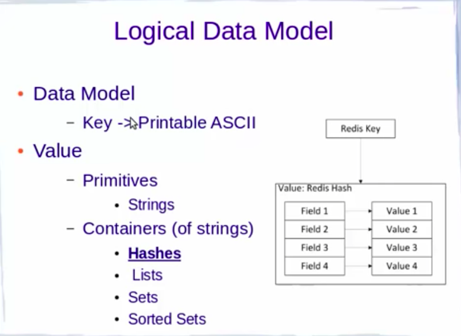
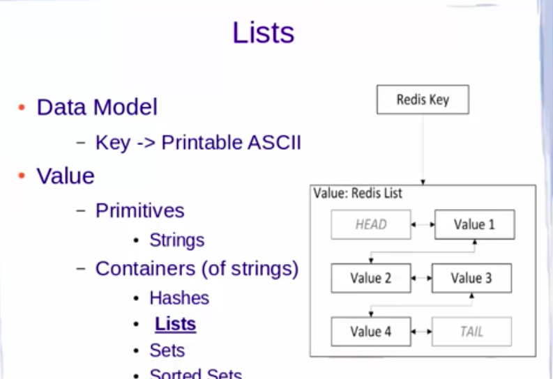

# Redis client 

## connection to local cluster and checking server info 

```
redis-check-aof  redis-check-rdb  redis-cli        
[ec2-user@ip-172-31-56-237 ~]$ redis-cli 
127.0.0.1:6379> 
127.0.0.1:6379> INFO server
# Server
redis_version:6.0.6
redis_git_sha1:00000000
redis_git_dirty:0
redis_build_id:3f4720fbc51b9c9
redis_mode:standalone
os:Linux 3.10.0-957.5.1.el7.x86_64 x86_64
arch_bits:64
multiplexing_api:epoll
atomicvar_api:atomic-builtin
gcc_version:8.3.1
process_id:14463
run_id:10e19890751d71a3e5a401c8c24089c101ab2399
tcp_port:6379
uptime_in_seconds:2111
uptime_in_days:0
hz:10
configured_hz:10
lru_clock:4502169
executable:/usr/bin/redis-server
config_file:/etc/redis.conf

```

## setting and getting keys 

```
127.0.0.1:6379> set x 100
OK
127.0.0.1:6379> get x
"100"
127.0.0.1:6379> set y "hello world "
OK
127.0.0.1:6379> get y
"hello world "

127.0.0.1:6379> keys * 
1) "x"
2) "y"

```

## setting and deletion of keys

```
127.0.0.1:6379> set name ashutoshh
OK
127.0.0.1:6379> keys * 
1) "name"
2) "x"
3) "y"
127.0.0.1:6379> del y
(integer) 1
127.0.0.1:6379> keys * 
1) "name"
2) "x"

```

## replacing value 

```
127.0.0.1:6379> get name
"ashutoshh"
127.0.0.1:6379> set name singh 
OK

127.0.0.1:6379> get name
"singh"
127.0.0.1:6379> 

```
## Delete all

```
127.0.0.1:6379> keys * 
1) "name"
2) "x"
127.0.0.1:6379> flushall 
OK
127.0.0.1:6379> keys * 
(empty array)

```

## Key will TTL  meaning setting keys time to live in seconds 

```
127.0.0.1:6379> SETEX name 10 hello
OK
127.0.0.1:6379> ttl name
(integer) 5
127.0.0.1:6379> ttl name
(integer) 3
127.0.0.1:6379> ttl name
(integer) 2
127.0.0.1:6379> keys *
(empty array)
127.0.0.1:6379> keys *
(empty array)
127.0.0.1:6379> set x 100
OK
127.0.0.1:6379> ttl x
(integer) -1

```

## check if not present then replace it

```
127.0.0.1:6379> set x 100
OK
127.0.0.1:6379> keys *
1) "x"
127.0.0.1:6379> get x
"100"
127.0.0.1:6379> setnx x 200
(integer) 0
127.0.0.1:6379> get x
"100"
127.0.0.1:6379> 
127.0.0.1:6379> setnx x1 200
(integer) 1
127.0.0.1:6379> 
127.0.0.1:6379> get x1
"200"

```

## checking lenth of values stored in keys

```
127.0.0.1:6379> keys * 
1) "x"
2) "x1"
127.0.0.1:6379> keys x*
1) "x"
2) "x1"
127.0.0.1:6379> set y "hello world this is me"
OK
127.0.0.1:6379> keys x*
1) "x"
2) "x1"
127.0.0.1:6379> keys *
1) "x"
2) "y"
3) "x1"
127.0.0.1:6379> STRLEN t
(integer) 0
127.0.0.1:6379> STRLEN y
(integer) 22
127.0.0.1:6379> STRLEN x
(integer) 3

127.0.0.1:6379> get x
"100"

```

## setting multiple keys 

```
127.0.0.1:6379> MSET x2 100 x3 hello name ashutoshh
OK
127.0.0.1:6379> keys * 
1) "name"
2) "x"
3) "x1"
4) "y"
5) "x2"
6) "x3"
127.0.0.1:6379> 

```

## TTL in Milisecond 

### 1 second == 1000 MS
```

127.0.0.1:6379> psetex g 500000 hii
OK
127.0.0.1:6379> keys *
1) "name"
2) "x"
3) "x1"
4) "y"
5) "g"
6) "x2"
7) "x3"
127.0.0.1:6379> get g
"hii"

```
## increase and decrease value by 1 

```
127.0.0.1:6379> get x
"100"
127.0.0.1:6379> INCR x
(integer) 101
127.0.0.1:6379> get x
"101"
127.0.0.1:6379> INCR x
(integer) 102
127.0.0.1:6379> decr  x
(integer) 101
127.0.0.1:6379> decr  x
(integer) 100

```

## increase and decrease by some number 

```
127.0.0.1:6379> INCRBY x 100
(integer) 200
127.0.0.1:6379> DECRBY x 120
(integer) 80

```

## append values

```
127.0.0.1:6379> set name ashutoshh
OK
127.0.0.1:6379> APPEND name " singh"
(integer) 15
127.0.0.1:6379> get name
"ashutoshh singh"

```

# working with Hashes 

## Hash is better way of storing data in field : value pair 
## can store upto 4 Billion pair

### example 


### examples 

```
127.0.0.1:6379> HMSET student  name ashutoshh age 29 lname singh tech devops 
OK

127.0.0.1:6379> keys * 
1) "student"


127.0.0.1:6379> HGET student  name 
"ashutoshh"


127.0.0.1:6379> HMGET student  name lname
1) "ashutoshh"
2) "singh

127.0.0.1:6379> HGETALL student 
1) "name"
2) "ashutoshh"
3) "age"
4) "29"
5) "lname"
6) "singh"
7) "tech"
8) "devops"


127.0.0.1:6379> hsetnx  student name delvex
(integer) 0


---
127.0.0.1:6379> hkeys student
1) "name"
2) "age"
3) "lname"
4) "tech"

```

### some more commands

```
127.0.0.1:6379> HVALS student 
1) "ashutoshh"
2) "29"
3) "singh"
4) "devops"

```

# Redis-cli Monitor 

## this is to monitor all the command by redis-client 

```
[ec2-user@ip-172-31-56-237 ~]$ redis-cli  monitor
OK
1598383186.051067 [0 127.0.0.1:33360] "COMMAND"
1598383190.838296 [0 127.0.0.1:33360] "keys" "*"
1598383203.383775 [0 127.0.0.1:33360] "info" "server"


```

# List 

## sorted by their insertion order 



