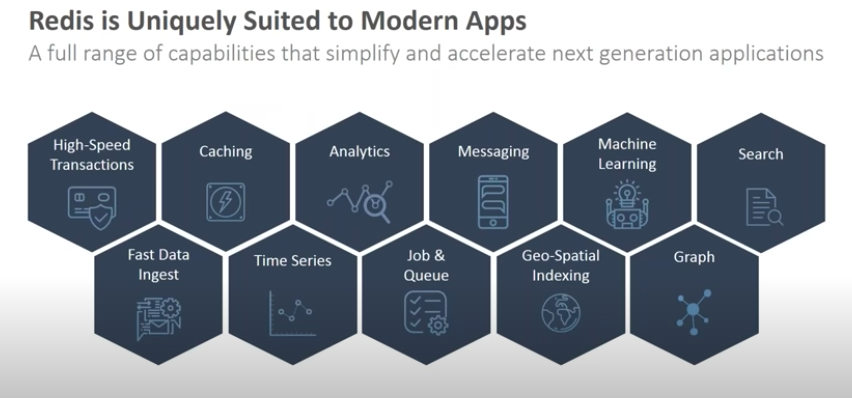
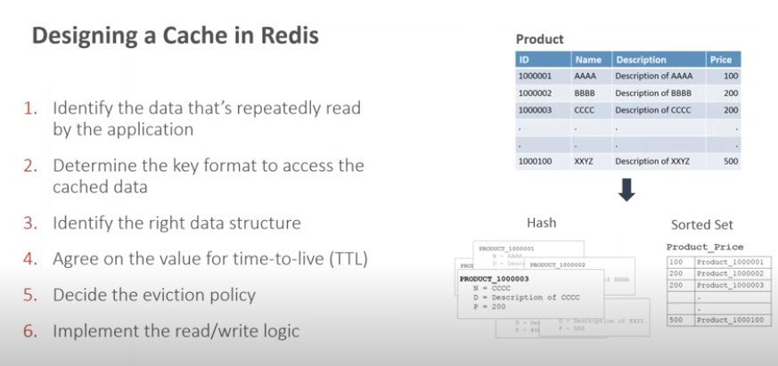
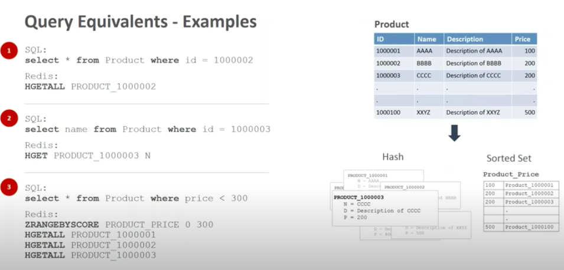
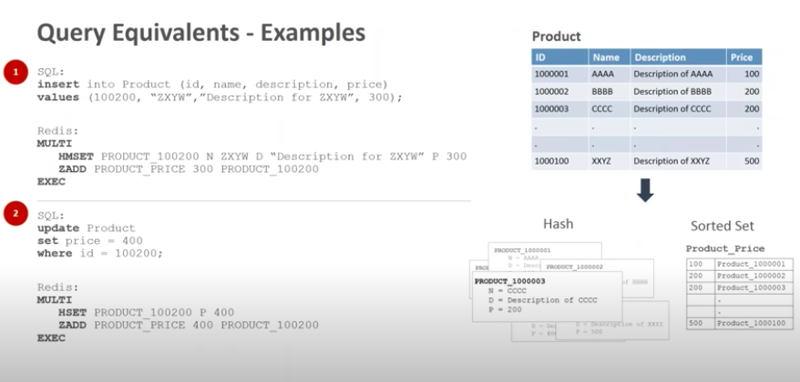
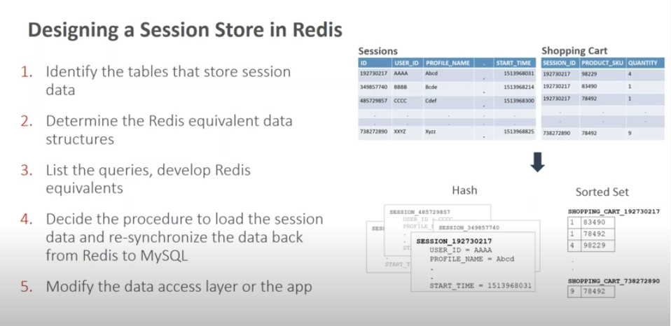
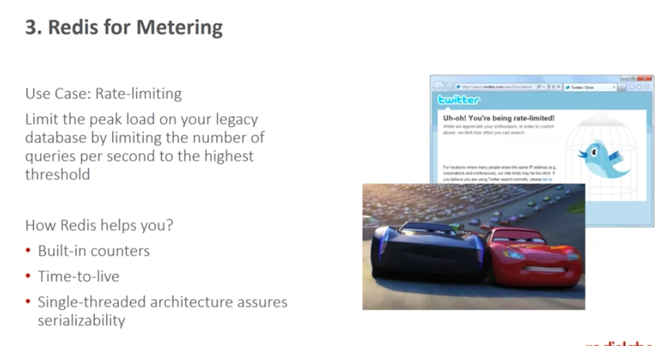
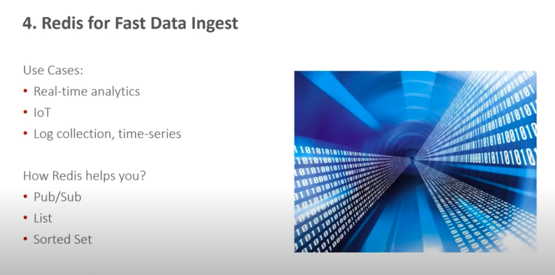
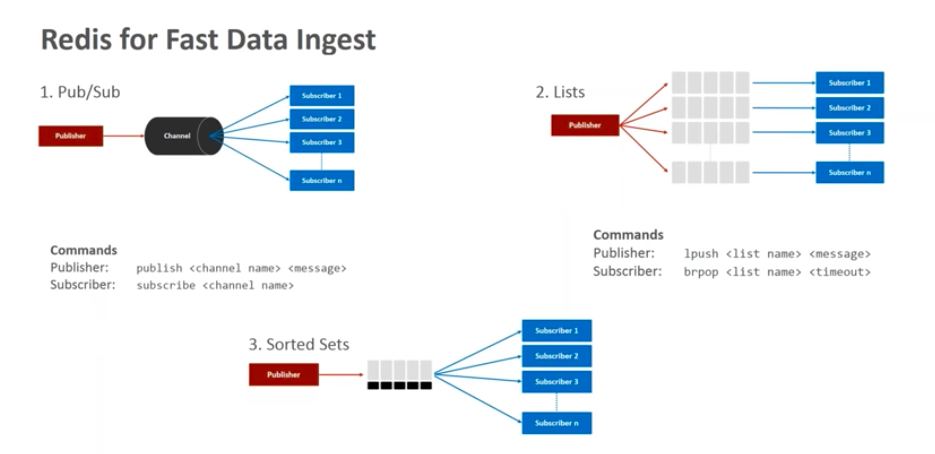

# Redis use cases 

## There are number of use cases of Redis listed below

## Redis as cache 

## Design cache 

## SQl like query

# Session store in Redis

## Its for higly engage experience and data life cycle is bit different 

## How we design session 

# Metering in Redis

# Redis as fast data ingest

## example

